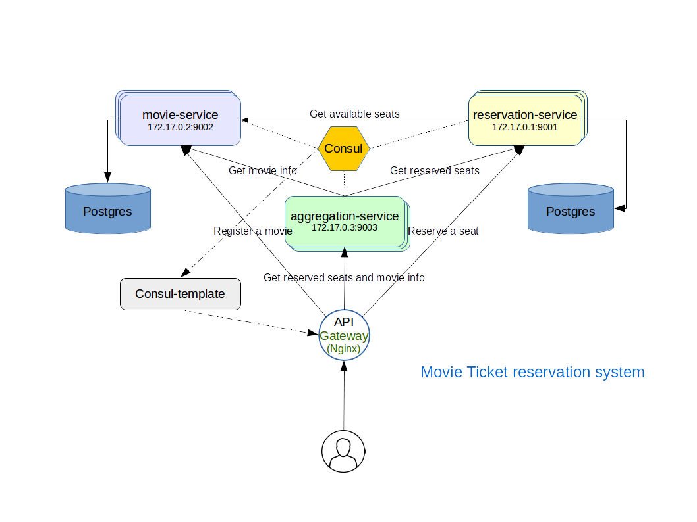

Movie Ticket reservation system
===============================

A simple demonstration of Microservices in Scala. 

### Features:
 - RESTful endpoints
 - Service Discovery
 - API Gateway


 
Introduction
------------
In this project I  have mainly focused on **Service Discovey** and **API Gateway**, because I believe it's a major issue in most microservices.
 
To scale up the project we have to run multiple instances of a certain service to balance the load.
Each service runs completely isolated, but in some cases they need to communicate with each other.

This projects consists of three main microservices:
 - movie-service:  This service is responsible for registering a movie before any reservation can happen. Also using this service we can retrieve basic information about the movie.
 - reservation-service: This service allows to reserve a seat for the movie. It depends on the *movie-service* to accomplish it's job.
 - aggregation-service: This service allows to see how many seats are reserved for a movie as well as the movie title. The information required by this service is retrieved from *movie-service* and *reservation-service*.

## Service Registry and Discovery

When you break down your monolithic application to several focused microservices, you will have to find an efficient way to locate your services; moreover, services will have to communicate with each other. That is exactly what service discovery is all about.

This system utilizes [**Consul**](http://consul.io) to implement the *client-side discovery pattern* and [scraml.io](http://scraml.io/) to access the REST APIs based on a RAML model.
When using client-side discovery pattern, the client is responsible for determining the network locations of available service instances and load balancing requests across them ([**ServiceFinder**](common/src/main/scala/com/veon/consul/discovery/ServiceFinder.scala)).
The client queries a service registry, which is a database of available service instances. The client then uses a load-balancing algorithm to select one of the available service instances and makes a request.
Movie Ticket reservation system uses the *self-registration pattern*, in this pattern service instance is responsible for registering and unregistering itself ([**ServiceRegistry**](common/src/main/scala/com/veon/consul/serviceregistry/ServiceRegistry.scala)) with the service registry. Also, the service instance sends heartbeat requests to prevent its registration from expiring.

An alternative approach, which decouples services from the service registry, is the third-party registration pattern such as [Registrator](http://gliderlabs.github.io/registrator/latest/). 


## API Gateway

An API Gateway is the single point of entry for your entire microservices-based application, presenting the API for each microservice

This system uses **Nginx Server** and **Consul Template** to implement an API Gateway. The *proxy_pass* module can be used to make Nginx, forward requests received from a client to another server and send back responses from the other server back to the client.

*Consul Template* constantly polls Consul for any changes to our services and reloads the nginx with new config file.

Requirements
------------

* JDK 8 (e.g. [http://www.oracle.com/technetwork/java/javase/downloads/index.html](http://www.oracle.com/technetwork/java/javase/downloads/index.html));
* sbt ([http://www.scala-sbt.org/release/docs/Getting-Started/Setup.html](http://www.scala-sbt.org/release/docs/Getting-Started/Setup.html));
* Consul ([http://consul.io](http://consul.io));
* Docker
* Docker-compose
* Nginx
* Postgres

### Run in Docker

For launching application in Docker, you must configure database docker instance and run docker image, generated by sbt.

Generating application docker image and publishing on localhost:
```bash
sbt docker:publishLocal
```

Pulling *Postgres* dokcer image from [https://hub.docker.com/_/postgres/](https://hub.docker.com/_/postgres/):
```bash
docker pull postgres
```

Pulling *Consul* docker image from [https://hub.docker.com/_/consul/](https://hub.docker.com/_/consul/)
```bash
docker pull consul
```

Starting microservices and binding all stuff together:
```bash
$ cd deploy
$ docker-compose -f movie-ticket-reservation.yml up
```

It usually takes a few seconds to register all the services in Consul. You can verify that all your services have been successfully registered on Consul by viewing the services from the Consul UI at [http://localhost:8500](http://localhost:8500).

After all your services are registered, we are ready to test our load balancer. Open up a new terminal session and issue the following cURL commands:

**Register a movie**

```bash
curl -X POST \
  http://localhost:8900/api/movies \
  -H 'content-type: application/json' \
  -d '{
  "imdbId" : "tt0111161",
  "screenId" : "screen_123456",
  "availableSeats" : 100,
  "title" : "The Shawshank Redemption"
}'
```

**Reserve a seat at the movie**
```bash
curl -X POST \
  http://localhost:8900/api/reserves \
  -H 'content-type: application/json' \
  -d '{
  "imdbId" : "tt0111161",
  "screenId" : "screen_123456"
}'
```

**Retrieve information about the movie**
```bash
curl -X GET \
  http://localhost:8900/api/info/tt0111161/screen_123456 
```

Stopping and removing containers:
```bash
$ docker-compose -f movie-ticket-reservation.yml stop
$ docker-compose -f movie-ticket-reservation.yml rm
```


